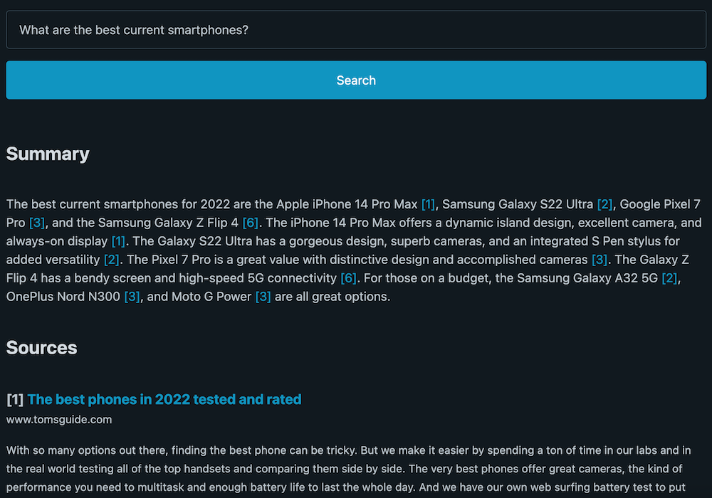

# Snip Search

Snip Search uses Google and GPT-3 to provide concise answers to search queries with citations.

## Screenshots

| Technical Q&A                   | Recommendation |
|---------------------------------|----------------|
|  |    |

## Example

`What are alternatives to FastAPI?`

```FastAPI and Flask are two popular Python web frameworks used to build APIs and web applications. FastAPI is a full-stack framework that offers everything you need to build an API, while Flask is a micro framework that doesn't provide all the features that FastAPI does. FastAPI focuses on reliability, security, and simplicity, and is designed to build APIs easily and quickly. Flask is less well-documented and is slower than FastAPI, but is useful when you want to prototype an idea quickly or build a simple web application. [1]...```

# Installation

* Clone this repository.
* Make sure you have Python 3.9+ installed.
* Run `pip install -r requirements.txt` to install the needed packages.
* Enter your OpenAI API key in `settings.py` in the `OPENAI_KEY` variable.
* Run `python app.py` to run the application.  By default it will run on port `5000`.

# Usage

* Visit `http://127.0.0.1:5000` to see the search interface.
* Enter a search query and click "Search".  Questions work best.
* It can take 10-20 seconds to get results, depending on the query.  You will see a summary and the sources used to generate the summary.

# How it works

* Initial search results are pulled from Google
* Each of the sites are scraped using requests
* The site HTML is stored in a local sqlite database
* Results are filtered to remove sites with too many ads or trackers
* Chunks of text are pulled from each site, and ranked against the search query
* The top N text chunks are used to generate a summary using GPT-3
* The summary is displayed along with the sources used to generate it